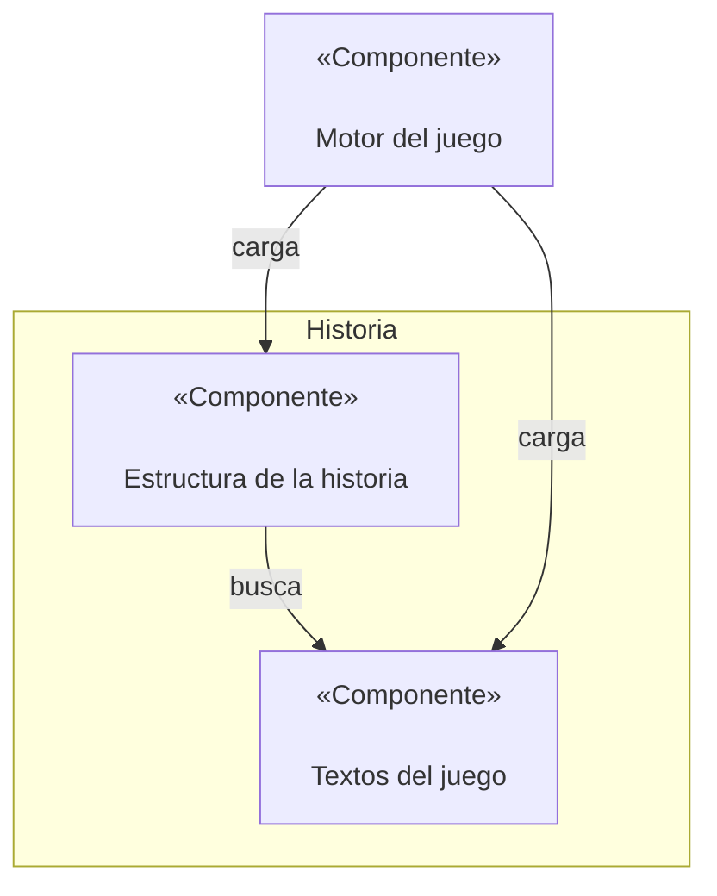

# Documento de diseño del juego

Se quiere crear un juego basado en las aventuras conversacionales de los años 70, con un enfoque un poco más moderno y actualizado que sirva para mostrar las características de la Universidad de Sevilla.

## Mecánicas de juego

### Mostrar los textos en pantalla

Cada escena es una pantalla distinta, en la que se muestra el texto y una imagen relevante. Si la escena tiene varios párrafos, deben mostrarse poco a poco, con unos 2 segundos por párrafo.

### Historial de partida

Al presionar un botón de la pantalla, se debe pausar el juego y mostrar por encima de la escena un conjunto de textos con barra deslizadora para consultar los eventos pasados. Estos eventos no es el log del juego tal cual, sino una serie de puntos clave que el juego debe recordar.

### Elegir una acción

Tras leer el contexto de la historia, aparecen las acciones disponibles en dos columnas si son opciones fijas o nada si es algo que se espera que el jugador averigüe. El jugador puede escribir la palabra o palabras clave resaltadas para seleccionar la acción. Si escribe algo incoherente o fuera del rango de acciones, se debe mostrar un error genérico o específico para la escena o acción concreta.

### Inicio del juego

Hay que especificar qué estado se corresponde con el primer paso del juego.

### Final del juego

Hay que especificar qué estado se corresponde con un fin de juego.

## Estilo visual

## Diagrama de componentes



* Textos del juego: fichero txt que contiene un párrafo de texto por línea.
* Estructura de la historia: archivo JSON que define una estructura de tipo grafo dirigido sobre las escenas de la historia.
* Motor del juego: componente que carga en orden los estados del juego, recibe las acciones del usuario y decide cómo avanzar.

## Estructura de datos

### Fichero de texto

Se trata de un fichero txt en el cual cada línea es un párrafo de la historia. Es importante que cada fila sea un párrafo porque el número de la línea es el identificador del párrafo.

### Fichero JSON de escenas

Este fichero contiene el orden de las escenas dentro del juego. Cada escena cuenta con una estructura definida:
```JSON
{
    "id":"#número",
    "tipo": "INICIAL/ACCION/FINAL",
    "textos":[líneaX,líneaY,...]
    "acciones": {
        "acción1": "#siguienteEscena",
        "acción2": "#siguienteEscena",
        ...
    }
    "error": líneaErrorGenéricoDeLaEscena
}
```

Si la única acción de una escena ACCION es "" (vacía), entonces se trata de una escena AUTOMÁTICA, y solo se necesita que el usuario pulse enter para continuar.

Cada una de las escenas se recoge dentro de un array, que luego será leído por el motor del juego.
