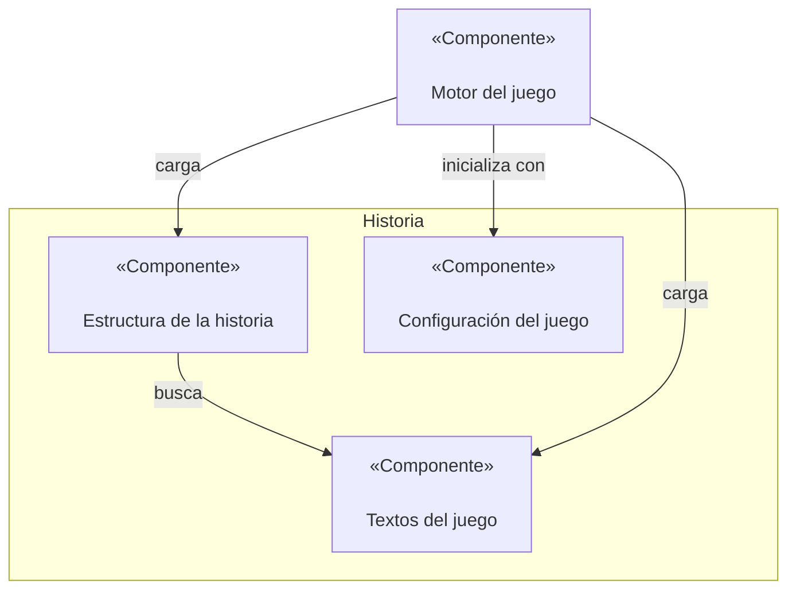

# Documento de diseño del juego

Se quiere crear un juego basado en las aventuras conversacionales de los años 70, con un enfoque un poco más moderno y actualizado que sirva para mostrar las características de la Universidad de Sevilla.

## Mecánicas de juego

### Mostrar los textos en pantalla

Cada escena es una pantalla distinta, en la que se muestra el texto y una imagen relevante. Si la escena tiene varios párrafos, deben mostrarse poco a poco, con unos 2 segundos por párrafo.

### Historial de partida

Al presionar un botón de la pantalla, se debe pausar el juego y mostrar por encima de la escena un conjunto de textos con barra deslizadora para consultar los eventos pasados. Estos eventos no es el log del juego tal cual, sino una serie de puntos clave que el juego debe recordar.

### Elegir una acción

Tras leer el contexto de la historia, aparecen las acciones disponibles en dos columnas. El jugador puede escribir la palabra o palabras clave resaltadas para seleccionar la acción. Si escribe algo incoherente o fuera del rango de acciones, se debe mostrar un error genérico o específico para la escena o acción concreta.

### Inicio del juego

Hay que especificar qué estado se corresponde con el primer paso del juego.

### Final del juego

Hay que especificar qué estado se corresponde con un fin de juego.

## Estilo visual

## Diagrama de componentes

