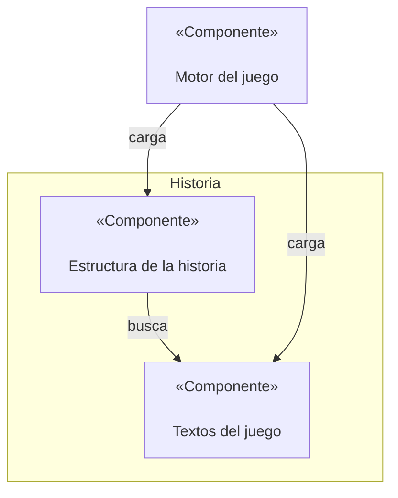
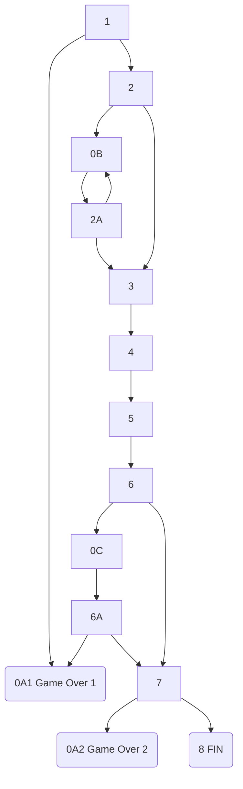

# Escape Room BUS

Aventura conversacional.

# Documento de diseño del juego

Se quiere crear un juego basado en las aventuras conversacionales de los años 70, con un enfoque un poco más moderno y actualizado que sirva para mostrar las características de la Universidad de Sevilla.

## Mecánicas de juego

### Mostrar los textos en pantalla

Cada escena es una pantalla distinta, en la que se muestra el texto y una imagen relevante. Si la escena tiene varios párrafos, deben mostrarse poco a poco, con unos 2 segundos por párrafo.

### Historial de partida

Al presionar un botón de la pantalla, se debe pausar el juego y mostrar por encima de la escena un conjunto de textos con barra deslizadora para consultar los eventos pasados. Estos eventos no es el log del juego tal cual, sino una serie de puntos clave que el juego debe recordar.

### Elegir una acción

Tras leer el contexto de la historia, aparecen las acciones disponibles en dos columnas si son opciones fijas o nada si es algo que se espera que el jugador averigüe. El jugador puede escribir la palabra o palabras clave resaltadas para seleccionar la acción. Si escribe algo incoherente o fuera del rango de acciones, se debe mostrar un error genérico o específico para la escena o acción concreta.

### Inicio del juego

Hay que especificar qué estado se corresponde con el primer paso del juego.

### Final del juego

Hay que especificar qué estado se corresponde con un fin de juego.

## Estilo visual

## Diagrama de componentes



* Textos del juego: fichero txt que contiene un párrafo de texto por línea.
* Estructura de la historia: archivo JSON que define una estructura de tipo grafo dirigido sobre las escenas de la historia.
* Motor del juego: componente que carga en orden los estados del juego, recibe las acciones del usuario y decide cómo avanzar.

## Estructura de datos

### Fichero de texto

Se trata de un fichero txt en el cual cada línea es un párrafo de la historia. Es importante que cada fila sea un párrafo porque el número de la línea es el identificador del párrafo.

### Fichero JSON de escenas

Este fichero contiene el orden de las escenas dentro del juego. Cada escena cuenta con una estructura definida:
```JSON
{
    "id":"#número",
    "tipo": "INICIAL/ACCION/FINAL",
    "textos":[líneaX,líneaY,...]
    "acciones": {
        "acción1": "#siguienteEscena",
        "acción2": "#siguienteEscena",
        ...
    }
    "error": líneaErrorGenéricoDeLaEscena
}
```

Si la única acción de una escena ACCION es "" (vacía), entonces se trata de una escena AUTOMÁTICA, y solo se necesita que el usuario pulse enter para continuar.

Cada una de las escenas se recoge dentro de un array, que luego será leído por el motor del juego.


# Sinopsis de la historia

Eres un investigador de la Universidad de Sevilla que está trabajando en la vacuna contra el cáncer de mama. Un día, decides contar con la ayuda de una editorial para publicar su investigación, pero la editorial Pay4Books solo está interesada en ganar dinero a costa de tu esfuerzo. ¿Conseguirás deshacerse del tirano que dirige la editorial y publicar su investigación en abierto?


# Desarrollo de la historia por escenas
## Escena 0A1
Game Over: El director de la editorial Pay4Books se ha adueñado de tu investigación y la ha publicado bajo el nombre de la editorial.

## Escena 0A2
Game Over: El director de la editorial no ha podido hacerse con el control de tu investigación, pero no la has publicado en Ciencia Abierta y como nadie la podrá leer pasará desapercibida para la comunidad científica.

## Escena 0B
No encuentras nada.

## Escena 0C
El director de la editorial parece que te ha leído la mente y está a punto de atraparte.

## Escena 1

Eres un investigador de la Universidad de Sevilla que está trabajando en la vacuna contra el cáncer de mama. No tienes apenas recursos ni nadie que colabore contigo, pero tu intuición te dice que vas por buen camino. Para continuar con tu investigación, te planteas solicitar ayuda a una editorial.

La editorial Pay4Books se da cuenta de que tu investigación es brillante y que podría llegar lejos con tu estudio, por lo que decide ayudarte. Ese mismo día por la tarde, recibes un mensaje en tu teléfono móvil de la editorial con el contrato que debes firmar:

"El investigador acuerda ceder todos los derechos de autor y beneficios económicos generados por el artículo de investigación a la editorial Pay4Books. Pay4Books tendrá exclusividad en la comercialización y distribución del artículo, y el escritor renuncia a cualquier participación en las ganancias derivadas de su venta."

Decides:

> Firmar (#0A1)

> Rechazar (#2)

Error: No entiendo lo que dices, tienes que escribir una de las opciones mostradas arriba.


## Escena 2

¡No puedes creer que la editorial quiera quedarse con todos los beneficios de tu investigación! Eres partidario de la Ciencia Abierta: ciencia libre y accesible para todos/as y te niegas a firmar un contrato así. Cierras el correo electrónico y decides encender el ordenador para buscar cómo publicar el resultado de tu investigación en abierto.

Al pulsar el botón de encendido el ordenador te pide la contraseña de tu usuario para iniciar sesión. ¡Vaya! Justo la cambiaste ayer y no eres capaz de recordar cuál era. Menos mal que la apuntaste en una tarjeta publicitaria y la guardaste en uno de los cajones del escritorio. Decides mirar en:

> Cajón derecho. (#0B)

> Cajón izquierdo. (#3)

Error: No entiendo lo que dices, tienes que escribir una de las opciones mostradas arriba.

## Escena 2A
Ayer guardaste la tarjeta en uno de los cajones del escritorio pero no la has visto en el cajón derecho. Esta vez decides mirar en:

> Cajón derecho. (#0B)

> Cajón izquierdo. (#3)

Error: No entiendo lo que dices, tienes que escribir una de las opciones mostradas arriba.

## Escena 3

¡Ahí estaba! Sacas la tarjeta y observas las diferentes letras que tiene escritas. ¿Cuál será el código?

> 8/16 (#4)

Error: Contraseña incorrecta

## Escena 4

El ordenador parece cargar durante unos segundos y finalmente se termina de encender. Sólo nos queda abrir el navegador y... ¡un momento! No tienes conexión a internet. ¿Qué está ocurriendo? Justo en ese momento te suena el teléfono: es el director de la editorial, te ha enviado un nuevo mensaje:

"Ya he visto que has decidido no firmar el contrato que te he enviado. No pienso permitir que publiques la investigación en abierto, así que me he tomado la molestia de cortarte el acceso a internet. ¡Te voy a robar la investigación y publicarla bajo el nombre de la editorial!"

Coges tus cosas y decides salir corriendo en dirección a la Universidad. Allí seguro que tienen conexión a internet. De camino a la universidad, ves que el director de la editorial te va siguiendo por la calle, por lo que decides comenzar a correr hasta llegar al laboratorio en el que trabajas. Nada más cerrar la puerta del laboratorio, decides llamar a Alba, tu mejor amiga:
* Tú:     Hola, el tirano me ha cortado el acceso a Internet y no puedo acceder a mis documentos, ¿me puedes ayudar? 
* Alba:   Sí, ¿qué puedo hacer por ti? 
* Tú:     Necesito que… 
* Alba:   ¡¡¡Habla más fuerte, que no te oigo!!! 
* Tú: Acabo de entrar al laboratorio y tengo al tirano dando golpes en la puerta queriendo entrar, ¡no quiero que me escuche!. Necesito que te pongas en contacto con la Universidad de Sevilla para que nos asesoren en temas de publicación en abierto, propiedad intelectual, licencias Creative Commons, etc., para poder compartir mi investigación y generar mayor impacto en la sociedad.
* Alba:   Vale, dame 2 minutos que me  ponga en contacto con ellos y ahora te devuelvo la llamada. 

¿Con qué servicio de la Universidad de Sevilla tendrá Alba que ponerse en contacto?

> Biblioteca (#5)

Error: El director de la editorial golpea más fuerte la puerta; creo que ahí no encontrarás la información que buscas.

## Escena 5
A los pocos minutos recibes una llamada a tu teléfono: es Alba, que ya ha hablado con la Biblioteca de la Universdad de Sevilla y ha recibido toda la información que necesitas. 
* Alba:   En su web tienen disponible mucha información para investigar y publicar, tienen un grupo de apoyo a la investigación, un grupo de Ciencia Abierta y un grupo de gestión de datos de investigación. Te envío por mensaje la URL de la página que debes consultar. ¡Mucha suerte!

Acto seguido finaliza la llamada telefónica y recibes en tu teléfono la dirección URL de la web donde encontrarás toda la información que necesitas: https://idus.us.es/

¿Cuántas comunidades diferentes podemos encontrar en idUS?

> 6 (#6)

Error: El director de la editorial golpea más fuerte la puerta; creo que ese no es el número correcto.

## Escena 6
Usando el Depósito de Investigación de la Universidad de Sevilla podrás conseguir no solo tener una mayor visibilidad, uso e impacto, sino que obtendrás mayor reconocimiento como autor, al ser más difundido y citado, garantizando además la preservación de tu investigación.

De repente  se escucha un ruido muy fuerte proveniente de la puerta: ¡es el director de la editorial, que ha conseguido derribar la puerta y te está buscando para robarte los documentos de tu investigación!

¡Rápido! ¿Qué decides hacer?

> Esconderte debajo de la mesa. (#0C)

> Salir corriendo por la puerta. (#7)

Error: No entiendo lo que dices, tienes que escribir una de las opciones mostradas arriba.

## Escena 6A
¡Rápido! ¿Qué decides hacer?

> Esconderte debajo de la mesa. (#0A1)

> Salir corriendo por la puerta. (#7)

Error: No entiendo lo que dices, tienes que escribir una de las opciones mostradas arriba.

## Escena 7
Consigues salir por la puerta y te diriges a toda velocidad a la Biblioteca de la Universidad más cercana. Allí te permitirán entregar el resultado de todos tus años de investigación y podrás publicarlo en Ciencia Abierta antes de que el director de la editorial te atrape.

Nada más llegar a la biblioteca, solicitas uno de los portátiles de préstamo que la Biblioteca de la Universidad de Sevilla tiene a disposición de los estudiantes e investigadores. Estás a punto de publicar tu artículo pero... necesitas indicar el tipo de licencia en el que publicar tu investigación.

> Copyright Tradicional (#0A2)

> Creative Commons (#8)

Error: No entiendo lo que dices, tienes que escribir una de las opciones mostradas arriba.

## Escena 8
Justo al pulsar el botón de enviar aparece el director de la editorial por la puerta. Intenta abalanzarte sobre ti pero ya es demasiado tarde: el resultado de tu investigación está ya publicado bajo una licencia Creative Comons que permite copiar, reproducir, distribuir y comunicar públicamente la obra, siempre y cuando se citen y reconozcan a los autores originales. No se permite, sin embargo, utilizar esta obra para fines comerciales ni la creación de obras derivadas de la misma.

¡Enhorabuena! Has publicado tu investigación con éxito y has derrotado al malvado director de la editorial Pay4Books.


# Diagrama de escenas




