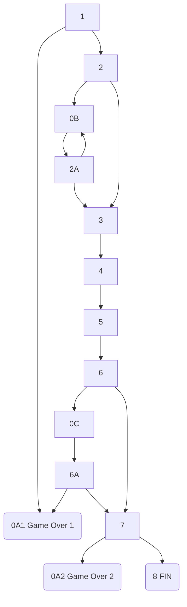

# Escape Room BUS

Aventura conversacional

## Getting started

To make it easy for you to get started with GitLab, here's a list of recommended next steps.

Already a pro? Just edit this README.md and make it your own. Want to make it easy? [Use the template at the bottom](#editing-this-readme)!

## Add your files

- [ ] [Create](https://docs.gitlab.com/ee/user/project/repository/web_editor.html#create-a-file) or [upload](https://docs.gitlab.com/ee/user/project/repository/web_editor.html#upload-a-file) files
- [ ] [Add files using the command line](https://docs.gitlab.com/ee/gitlab-basics/add-file.html#add-a-file-using-the-command-line) or push an existing Git repository with the following command:

```
cd existing_repo
git remote add origin http://172.31.0.190:8069/tecnibus5/escape-room-bus.git
git branch -M main
git push -uf origin main
```

## Integrate with your tools

- [ ] [Set up project integrations](http://172.31.0.190:8069/tecnibus5/escape-room-bus/-/settings/integrations)

## Collaborate with your team

- [ ] [Invite team members and collaborators](https://docs.gitlab.com/ee/user/project/members/)
- [ ] [Create a new merge request](https://docs.gitlab.com/ee/user/project/merge_requests/creating_merge_requests.html)
- [ ] [Automatically close issues from merge requests](https://docs.gitlab.com/ee/user/project/issues/managing_issues.html#closing-issues-automatically)
- [ ] [Enable merge request approvals](https://docs.gitlab.com/ee/user/project/merge_requests/approvals/)
- [ ] [Automatically merge when pipeline succeeds](https://docs.gitlab.com/ee/user/project/merge_requests/merge_when_pipeline_succeeds.html)

## Test and Deploy

Use the built-in continuous integration in GitLab.

- [ ] [Get started with GitLab CI/CD](https://docs.gitlab.com/ee/ci/quick_start/index.html)
- [ ] [Analyze your code for known vulnerabilities with Static Application Security Testing(SAST)](https://docs.gitlab.com/ee/user/application_security/sast/)
- [ ] [Deploy to Kubernetes, Amazon EC2, or Amazon ECS using Auto Deploy](https://docs.gitlab.com/ee/topics/autodevops/requirements.html)
- [ ] [Use pull-based deployments for improved Kubernetes management](https://docs.gitlab.com/ee/user/clusters/agent/)
- [ ] [Set up protected environments](https://docs.gitlab.com/ee/ci/environments/protected_environments.html)

***

# Editing this README

When you're ready to make this README your own, just edit this file and use the handy template below (or feel free to structure it however you want - this is just a starting point!).  Thank you to [makeareadme.com](https://www.makeareadme.com/) for this template.

## Suggestions for a good README
Every project is different, so consider which of these sections apply to yours. The sections used in the template are suggestions for most open source projects. Also keep in mind that while a README can be too long and detailed, too long is better than too short. If you think your README is too long, consider utilizing another form of documentation rather than cutting out information.

## Name
Choose a self-explaining name for your project.

## Description
Let people know what your project can do specifically. Provide context and add a link to any reference visitors might be unfamiliar with. A list of Features or a Background subsection can also be added here. If there are alternatives to your project, this is a good place to list differentiating factors.

## Badges
On some READMEs, you may see small images that convey metadata, such as whether or not all the tests are passing for the project. You can use Shields to add some to your README. Many services also have instructions for adding a badge.

## Visuals
Depending on what you are making, it can be a good idea to include screenshots or even a video (you'll frequently see GIFs rather than actual videos). Tools like ttygif can help, but check out Asciinema for a more sophisticated method.

## Installation
Within a particular ecosystem, there may be a common way of installing things, such as using Yarn, NuGet, or Homebrew. However, consider the possibility that whoever is reading your README is a novice and would like more guidance. Listing specific steps helps remove ambiguity and gets people to using your project as quickly as possible. If it only runs in a specific context like a particular programming language version or operating system or has dependencies that have to be installed manually, also add a Requirements subsection.

## Usage
Use examples liberally, and show the expected output if you can. It's helpful to have inline the smallest example of usage that you can demonstrate, while providing links to more sophisticated examples if they are too long to reasonably include in the README.

## Support
Tell people where they can go to for help. It can be any combination of an issue tracker, a chat room, an email address, etc.

## Roadmap
If you have ideas for releases in the future, it is a good idea to list them in the README.

## Contributing
State if you are open to contributions and what your requirements are for accepting them.

For people who want to make changes to your project, it's helpful to have some documentation on how to get started. Perhaps there is a script that they should run or some environment variables that they need to set. Make these steps explicit. These instructions could also be useful to your future self.

You can also document commands to lint the code or run tests. These steps help to ensure high code quality and reduce the likelihood that the changes inadvertently break something. Having instructions for running tests is especially helpful if it requires external setup, such as starting a Selenium server for testing in a browser.

## Authors and acknowledgment
Show your appreciation to those who have contributed to the project.

## License
For open source projects, say how it is licensed.

## Project status
If you have run out of energy or time for your project, put a note at the top of the README saying that development has slowed down or stopped completely. Someone may choose to fork your project or volunteer to step in as a maintainer or owner, allowing your project to keep going. You can also make an explicit request for maintainers.


# Sinopsis de la historia

Eres un investigador de la Universidad de Sevilla que está trabajando en la vacuna contra el cáncer de mama. Un día, decides contar con la ayuda de una editorial para publicar su investigación, pero la editorial Pay4Books solo está interesada en ganar dinero a costa de tu esfuerzo. ¿Conseguirás deshacerse del tirano que dirige la editorial y publicar su investigación en abierto?


# Desarrollo de la historia por escenas
## Escena 0A1
Game Over: El director de la editorial Pay4Books se ha adueñado de tu investigación y la ha publicado bajo el nombre de la editorial.

## Escena 0A2
Game Over: El director de la editorial no ha podido hacerse con el control de tu investigación, pero no la has publicado en Ciencia Abierta y como nadie la podrá leer pasará desapercibida para la comunidad científica.

## Escena 0B
No encuentras nada.

## Escena 0C
El director de la editorial parece que te ha leído la mente y está a punto de atraparte.

## Escena 1

Eres un investigador de la Universidad de Sevilla que está trabajando en la vacuna contra el cáncer de mama. No tienes apenas recursos ni nadie que colabore contigo, pero tu intuición te dice que vas por buen camino. Para continuar con tu investigación, te planteas solicitar ayuda a una editorial.

La editorial Pay4Books se da cuenta de que tu investigación es brillante y que podría llegar lejos con tu estudio, por lo que decide ayudarte. Ese mismo día por la tarde, recibes un mensaje en tu teléfono móvil de la editorial con el contrato que debes firmar:

"El investigador acuerda ceder todos los derechos de autor y beneficios económicos generados por el artículo de investigación a la editorial Pay4Books. Pay4Books tendrá exclusividad en la comercialización y distribución del artículo, y el escritor renuncia a cualquier participación en las ganancias derivadas de su venta."

Decides:

> Firmar (#0A1)

> Rechazar (#2)

Error: No entiendo lo que dices, tienes que escribir una de las opciones mostradas arriba.


## Escena 2

¡No puedes creer que la editorial quiera quedarse con todos los beneficios de tu investigación! Eres partidario de la Ciencia Abierta: ciencia libre y accesible para todos/as y te niegas a firmar un contrato así. Cierras el correo electrónico y decides encender el ordenador para buscar cómo publicar el resultado de tu investigación en abierto.

Al pulsar el botón de encendido el ordenador te pide la contraseña de tu usuario para iniciar sesión. ¡Vaya! Justo la cambiaste ayer y no eres capaz de recordar cuál era. Menos mal que la apuntaste en una tarjeta publicitaria y la guardaste en uno de los cajones del escritorio. Decides mirar en:

> Cajón derecho. (#0B)

> Cajón izquierdo. (#3)

Error: No entiendo lo que dices, tienes que escribir una de las opciones mostradas arriba.

## Escena 2A
Ayer guardaste la tarjeta en uno de los cajones del escritorio pero no la has visto en el cajón derecho. Esta vez decides mirar en:

> Cajón derecho. (#0B)

> Cajón izquierdo. (#3)

Error: No entiendo lo que dices, tienes que escribir una de las opciones mostradas arriba.

## Escena 3

¡Ahí estaba! Sacas la tarjeta y observas las diferentes letras que tiene escritas. ¿Cuál será el código?

> 8/16 (#4)

Error: Contraseña incorrecta

## Escena 4

El ordenador parece cargar durante unos segundos y finalmente se termina de encender. Sólo nos queda abrir el navegador y... ¡un momento! No tienes conexión a internet. ¿Qué está ocurriendo? Justo en ese momento te suena el teléfono: es el director de la editorial, te ha enviado un nuevo mensaje:

"Ya he visto que has decidido no firmar el contrato que te he enviado. No pienso permitir que publiques la investigación en abierto, así que me he tomado la molestia de cortarte el acceso a internet. ¡Te voy a robar la investigación y publicarla bajo el nombre de la editorial!"

Coges tus cosas y decides salir corriendo en dirección a la Universidad. Allí seguro que tienen conexión a internet. De camino a la universidad, ves que el director de la editorial te va siguiendo por la calle, por lo que decides comenzar a correr hasta llegar al laboratorio en el que trabajas. Nada más cerrar la puerta del laboratorio, decides llamar a Alba, tu mejor amiga:
* Tú:     Hola, el tirano me ha cortado el acceso a Internet y no puedo acceder a mis documentos, ¿me puedes ayudar? 
* Alba:   Sí, ¿qué puedo hacer por ti? 
* Tú:     Necesito que… 
* Alba:   ¡¡¡Habla más fuerte, que no te oigo!!! 
* Tú: Acabo de entrar al laboratorio y tengo al tirano dando golpes en la puerta queriendo entrar, ¡no quiero que me escuche!. Necesito que te pongas en contacto con la Universidad de Sevilla para que nos asesoren en temas de publicación en abierto, propiedad intelectual, licencias Creative Commons, etc., para poder compartir mi investigación y generar mayor impacto en la sociedad.
* Alba:   Vale, dame 2 minutos que me  ponga en contacto con ellos y ahora te devuelvo la llamada. 

¿Con qué servicio de la Universidad de Sevilla tendrá Alba que ponerse en contacto?

> Biblioteca (#5)

Error: El director de la editorial golpea más fuerte la puerta; creo que ahí no encontrarás la información que buscas.

## Escena 5
A los pocos minutos recibes una llamada a tu teléfono: es Alba, que ya ha hablado con la Biblioteca de la Universdad de Sevilla y ha recibido toda la información que necesitas. 
* Alba:   En su web tienen disponible mucha información para investigar y publicar, tienen un grupo de apoyo a la investigación, un grupo de Ciencia Abierta y un grupo de gestión de datos de investigación. Te envío por mensaje la URL de la página que debes consultar. ¡Mucha suerte!

Acto seguido finaliza la llamada telefónica y recibes en tu teléfono la dirección URL de la web donde encontrarás toda la información que necesitas: https://idus.us.es/

¿Cuántas comunidades diferentes podemos encontrar en idUS?

> 6 (#6)

Error: El director de la editorial golpea más fuerte la puerta; creo que ese no es el número correcto.

## Escena 6
Usando el Depósito de Investigación de la Universidad de Sevilla podrás conseguir no solo tener una mayor visibilidad, uso e impacto, sino que obtendrás mayor reconocimiento como autor, al ser más difundido y citado, garantizando además la preservación de tu investigación.

De repente  se escucha un ruido muy fuerte proveniente de la puerta: ¡es el director de la editorial, que ha conseguido derribar la puerta y te está buscando para robarte los documentos de tu investigación!

¡Rápido! ¿Qué decides hacer?

> Esconderte debajo de la mesa. (#0C)

> Salir corriendo por la puerta. (#7)

Error: No entiendo lo que dices, tienes que escribir una de las opciones mostradas arriba.

## Escena 6A
¡Rápido! ¿Qué decides hacer?

> Esconderte debajo de la mesa. (#0A1)

> Salir corriendo por la puerta. (#7)

Error: No entiendo lo que dices, tienes que escribir una de las opciones mostradas arriba.

## Escena 7
Consigues salir por la puerta y te diriges a toda velocidad a la Biblioteca de la Universidad más cercana. Allí te permitirán entregar el resultado de todos tus años de investigación y podrás publicarlo en Ciencia Abierta antes de que el director de la editorial te atrape.

Nada más llegar a la biblioteca, solicitas uno de los portátiles de préstamo que la Biblioteca de la Universidad de Sevilla tiene a disposición de los estudiantes e investigadores. Estás a punto de publicar tu artículo pero... necesitas indicar el tipo de licencia en el que publicar tu investigación.

> Copyright Tradicional (#0A2)

> Creative Commons (#8)

Error: No entiendo lo que dices, tienes que escribir una de las opciones mostradas arriba.

## Escena 8
Justo al pulsar el botón de enviar aparece el director de la editorial por la puerta. Intenta abalanzarte sobre ti pero ya es demasiado tarde: el resultado de tu investigación está ya publicado bajo una licencia Creative Comons que permite copiar, reproducir, distribuir y comunicar públicamente la obra, siempre y cuando se citen y reconozcan a los autores originales. No se permite, sin embargo, utilizar esta obra para fines comerciales ni la creación de obras derivadas de la misma.

¡Enhorabuena! Has publicado tu investigación con éxito y has derrotado al malvado director de la editorial Pay4Books.


# Diagrama de escenas




